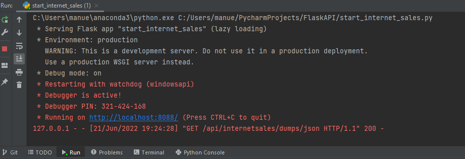
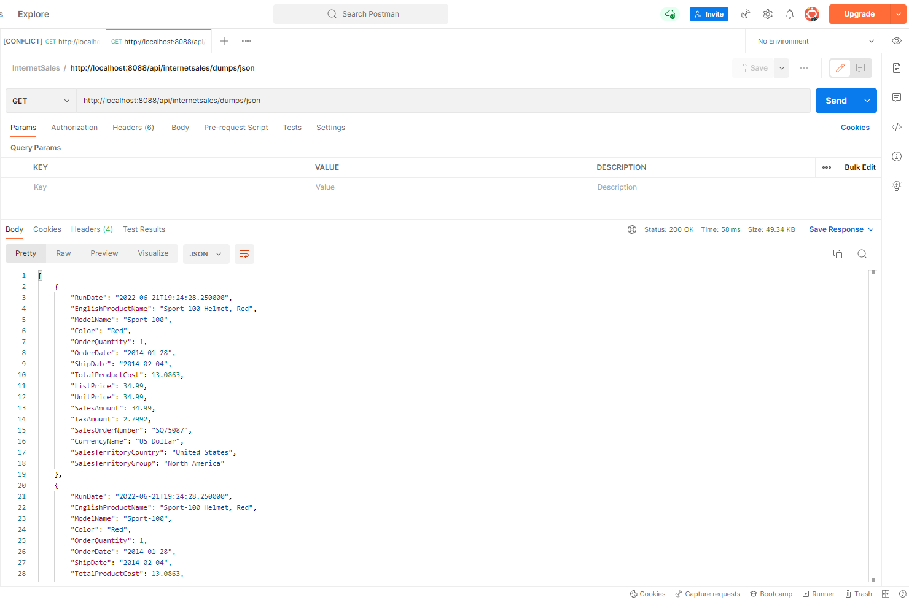
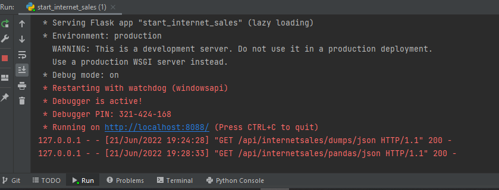
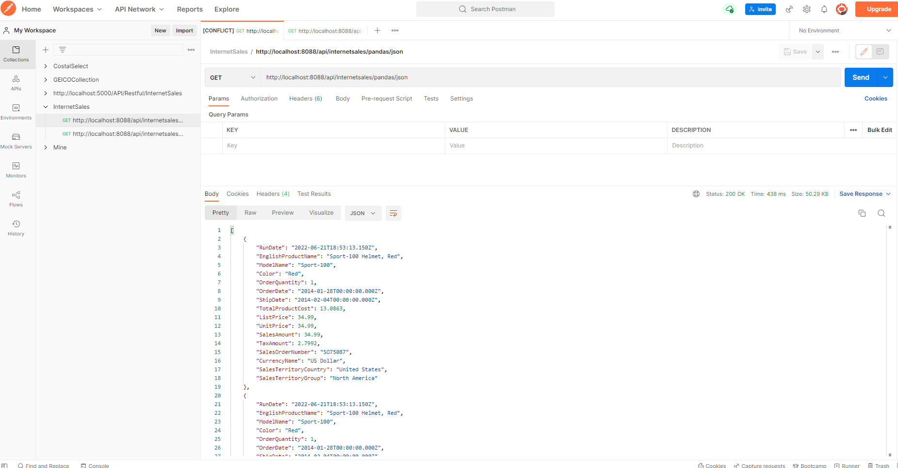

# flask-apis
API Development with Flask

The start_internet_sales.py file, is the Flask Application's starting point. By running it, a server instance is launched, and you can consume each endpoint's content. If you want to test the app before launching the server, run **run_internet_sales_inplace.py** file and you'll get what an endpoint would deliver.
This Flask app was tested in Linux (Ubuntu 20) and in a Windows 10 Pro machines.

## Content of this Repository:
- CurrentInternetSales.sql: Stored Procedure used to pull out data from a SQL SERVER database, which in turn will be served by an endpoint.
- InternetSalesResponseViaPostman.json: The resulting json data consumed from one of the APIs.
- database_connection.py: Python class for connecting to a SQL Server database using ODBC connection.
- hello_world.py: Running this file, the classic "Hello World" message is rendered in a Web Browser. This a very basic Flask app.
- run_internet_sales_inplace.py: If you want to test the app before launching the server, run this.
- start_internet_sales.py: This is the app's starting point.  

## Running the Flask app

As mentioned above, run the script start_internet_sales.py and you have your Flask app up and running as depicted below. 
You should have something like this when the endpoing is hit. In this case, the endpoint is /api/internetsales/dumps/json.

The JSON formatted data seen on Postman after hitting /api/internetsales/dumps/json:

Likewise, hitting this endpoint, /api/internetsales/pandas/json, you should have something lake this:

and the corresponding JSON data on Postman.

Pretty cool huh? 
This illustrates how it is possible to serve APIs with Flask and serve JSON formatted data from a SQL Server database. This is useful in scenarios where an organization makes available its data to external entities.
